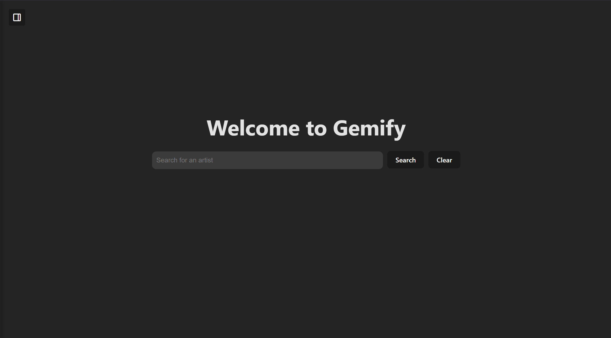

# 🎧 Gemify



Gemify is a modern web application that allows users to explore music in a smarter way. By integrating the **Spotify API** and **Gemini API**, Gemify lets users search for artists, view their albums, track listings, and release dates. It also lets users to chat with an AI music expert for song recommendations or detailed artist insights.

---

## 🚀 Features

- 🔍 **Search by Artist**  
  Quickly search for albums by inputting any music artist, powered by the **Spotify API**.

- 💿 **View Albums and Tracks**  
  Instantly view all albums released by the artist, along with:
  - Album names  
  - Track listings  
  - Release dates

- 🤖 **Chat with Gemini AI**  
  Ask the chatbot anything like:
  - “What’s the meaning behind this song?”  
  - “Can you recommend songs similar to this artist?”  
  - “Tell me about the artist’s musical style or history”

  Powered by **Gemini API** with custom prompt engineering for insightful and context-aware responses.

---

## 🛠️ Technologies Used

- **JavaScript** and **React** – Frontend framework   
- **Bootstrap / CSS** – For UI and styling
- **Node.js / Vite** – Build tool for running the app
- **Spotify API** – To fetch artist, album, and track data  
- **Gemini API** – For AI-powered music insights 
- **Prompt Engineering** – To optimize chatbot responses

---

## 🔑 Setup & Installation

1. **Clone the repository:**
   ```bash
   git clone https://github.com/louisnguyenn/gemify.git
   cd gemify
   
2. Install dependencies:
   ```bash
   npm install
   
4. Create a .env file in the root with the following:
   ```.env
   VITE_SPOTIFY_CLIENT_ID=your_spotify_client_id
   VITE_SPOTIFY_CLIENT_SECRET=your_spotify_client_secret
   VITE_GEMINI_API_KEY=your_gemini_api_key

5. Run the app:
   ```bash
   npm run dev

## 🙌 Credits
Created by Louis Nguyen  
Powered by Spotify and Google Gemini APIs
